# 🎙️ Awesome AI Meeting Assistant 🤖

> 🚀 **The Ultimate Curated List of AI Meeting Assistant SaaS Products & Open-Source Projects**  
> *Comprehensive guide to AI meeting transcription, automated notes, action item generation, speaker diarization, real-time call summaries, and meeting intelligence tools.*

**Last updated: September 2026**

---

## 📌 Table of Contents

- [📊 Market Overview & Industry Intelligence](#-market-overview--industry-intelligence)
- [🏢 SaaS & Hosted Commercial Platforms](#-saas--hosted-commercial-platforms)
- [💻 Open-Source & Local-First GitHub Projects](#-open-source--local-first-github-projects)
- [🤝 How to Contribute](#-how-to-contribute)
- [💖 Support & Sponsorship](#-support--sponsorship)
- [⚠️ Disclaimer](#%EF%B8%8F-disclaimer)
- [📈 Star History](#-star-history)

---

## 📊 Market Overview & Industry Intelligence

> [!IMPORTANT]
> **Market Size & Structure**: The global **AI Meeting Assistant and Speech Intelligence market** is estimated at **$2.5 Billion in 2026** (growing at a ~24% CAGR toward $5.8B by 2030). The sector is **moderately fragmented**: while category leaders (Otter.ai, Fireflies.ai, Fathom) capture significant enterprise and SMB mindshare, no single vendor enjoys a "winner-take-all" monopoly. Specialized sales-coaching platforms (Avoma, Gong) and local privacy-first open-source tools flourish alongside desktop notetakers.

---

## 🏢 SaaS & Hosted Commercial Platforms

Commercial AI meeting assistants provide turn-key calendar integrations, automated meeting bots, multi-language speech-to-text, CRM sync (Salesforce, HubSpot), and team-wide searchable conversation libraries.

| Company / Product | Valuation / Revenue | Starting Paid Tier Price | Free Tier / Trial Limit | Key Features & Focus |
| :--- | :--- | :--- | :--- | :--- |
| 🦫 **[Otter.ai](https://otter.ai/)** | ~$1.0B Valuation ($100M+ ARR) | **$16.99 / user / month** (Pro) | **300 transcription mins/month** (30 mins/cat) | Real-time captions, automated OtterPilot bot, meeting summaries, team action items. |
| 🪰 **[Fireflies.ai](https://fireflies.ai/)** | ~$300M Valuation ($30M+ ARR) | **$18.00 / user / month** (Pro) | **800 mins storage free limit** (transcription preview) | Fred AI bot, CRM sync, custom AI prompts, multi-channel search & call analytics. |
| 🎯 **[Fathom](https://fathom.video/)** | ~$150M Valuation ($15M+ ARR) | **$24.00 / user / month** (Premium) | **100% Free for personal use** (Unlimited recordings) | Instant meeting highlights, seamless Zoom/Teams/Meet integration, effortless notes sharing. |
| 🔮 **[Read AI](https://www.read.ai/)** | ~$100M Valuation ($12M+ ARR) | **$19.75 / user / month** (Pro) | **5 free meetings / month** | Meeting metrics, participant engagement scores, auto-summaries, cross-meeting recaps. |
| 💼 **[Avoma](https://www.avoma.com/)** | ~$80M Valuation ($10M+ ARR) | **$19.00 / user / month** (Starter) | **14-day Free Trial** (Full feature access) | AI conversation intelligence, sales coaching, CRM auto-fill, template-driven meeting notes. |
| 🧠 **[Sembly AI](https://www.sembly.ai/)** | ~$50M Valuation ($6M+ ARR) | **$15.00 / user / month** (Professional) | **4 hours transcription / month** | Proxy attendance ("send Sembly in your place"), multi-language notes, tasks breakdown. |
| ⚡ **[tl;dv](https://tldv.io/)** | ~$40M Valuation ($5M+ ARR) | **$25.00 / user / month** (Pro) | **Unlimited free recordings** (Basic AI summaries) | Video clip timestamping, AI meeting search across calls, multi-language transcription. |
| 🤖 **[Jamie AI](https://www.meetjamie.ai/)** | ~$20M Valuation ($3M+ ARR) | **€24.00 / user / month** (Standard) | **7-day Free Trial** (Includes 10 meeting credits) | Bot-free audio recording, offline/local desktop capture, executive summaries. |
| 🚀 **[Supernormal](https://www.supernormal.com/)** | ~$20M Valuation ($3M+ ARR) | **$18.00 / user / month** (Pro) | **1,000 meeting mins / month free** | Formatting templates, automated action items export to Notion, Google Docs & Zapier. |
| 📊 **[MeetGeek](https://meetgeek.ai/)** | ~$15M Valuation ($2M+ ARR) | **$19.00 / user / month** (Pro) | **5 hours transcription / month** | Auto-video recording, transcript keywords highlighting, team workflow integrations. |

---

## 💻 Open-Source & Local-First GitHub Projects

Privacy-first and developer-friendly alternatives built on OpenAI Whisper, PyAnnote, and local LLMs (Ollama, Llama.cpp) for complete data sovereignty without recurring SaaS fees.

-  **[OpenAI Whisper](https://github.com/openai/whisper)** — General-purpose speech recognition model trained on 680,000 hours of multilingual data. The foundation of modern open-source meeting transcription.
-  **[whisper.cpp](https://github.com/ggerganov/whisper.cpp)** — High-performance C/C++ port of OpenAI's Whisper model with zero dependencies, lightweight CPU/GPU execution for local meeting processing.
-  **[pyannote-audio](https://github.com/pyannote/pyannote-audio)** — Neural toolkit written in Python for speaker diarization, speaker verification, and overlap detection in meeting recordings.
-  **[faster-whisper](https://github.com/SYSTRAN/faster-whisper)** — Re-implementation of OpenAI Whisper using CTranslate2, delivering up to 4x faster transcription speed with lower memory usage.
-  **[Meetily](https://github.com/Zackriya-Solutions/meetily)** — Popular open-source, self-hosted AI meeting notetaker (MIT). Captures system audio with local Whisper transcription and Ollama LLM summaries without sending data to third parties.
-  **[Meet2Notes](https://github.com/estebanstifli/Meet2Notes)** — Local-first, self-hosted AI meeting assistant for transcription, speaker diarization, and structured notes on Windows, macOS, and Linux.
-  **[MeetingScribe](https://github.com/elmoghany/meeting-scribe)** — Local, key-free MIT meeting-notes agent for Google Meet and Zoom. Features live transcription, diarization, AI summaries, and "ask your meeting" chat without cloud APIs.
-  **[Memoir-Ai](https://github.com/TARIFUDDIN/Memoir-Ai)** — Open-source enterprise-style meeting intelligence platform aiming at autonomous recording, diarization, global RAG across meetings, and Jira/Slack integrations.

---

## 🤝 How to Contribute

Contributions are welcome! Please follow these simple steps:

1. 🍴 Fork the repository.
2. 📝 Add or edit entries in `README.md` keeping formatting consistent.
3. 🔍 Ensure pricing, free tiers, and links are accurate and factual.
4. 🚀 Submit a Pull Request with a clear description of your additions.

---

## 💖 Support & Sponsorship

If you find this curated list useful for your work, research, or projects, please consider supporting the project:

- ⭐ **Star** this repository to show your support!
- 🍴 **Fork** and share it with colleagues and communities.
- ☕ **Buy me a coffee**: Sponsor this project on [GitHub Sponsors](https://github.com/sponsors/ishandutta2007)!

---

## ⚠️ Disclaimer

- This list is **community-curated** for educational and research purposes.
- Recording meetings requires strict compliance with local consent laws and organization policies.
- Ensure all participants are informed prior to enabling automated recording bots or audio capture.

---

## 📈 Star History

